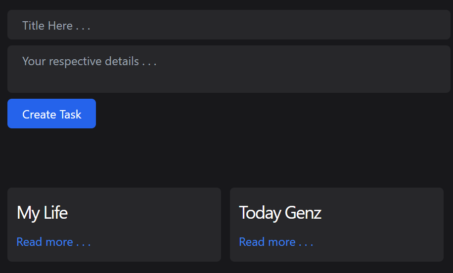

#  Note-Taking App

A note taking app build with complete Nodejs, ExpressJs , Tailwindcss and EJS 

  

##  Table of Contents

-  [Technologies-Used](#technologies-used)

-  [Installation](#installation)

-  [License](#license)

-  [Screenshots](#screenshot)

  

##  Technologies-Used

  

- NodeJs

- ExpressJs

- EJS

- Tailwindcss

  

  

##  Installation

  

Step-by-step instructions to set up the project locally:

1. Clone the repository:

       git clone https://github.com/Roshan-Metrix/note-taking.git

  
2. Navigate to the project directory:

       cd note-taking

3. Install dependencies

       npm install  

4. Run App

       npm start dev

  
## License

This project is licensed under the [MIT License](license.txt).

## Screenshot

